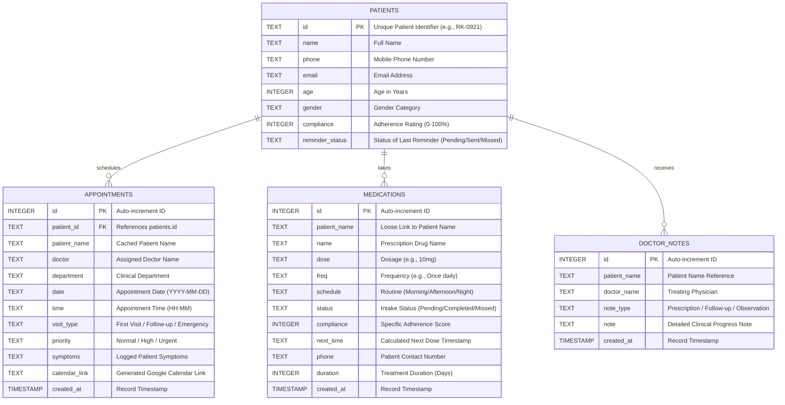

# RK Health: AI Smart Patient Appointment & Medication Reminder System

## Project Description
**RK Health** is an intelligent, patient-centric healthcare record management and dashboard system. It consolidates appointment scheduling, medication tracking, automated notifications (via email and SMS), and AI-driven clinical summaries into a unified, responsive interface. Designed to streamline clinical workflows and improve patient treatment compliance, the platform provides:
* **Appointment Scheduling Module:** Automates booking, assigns priority, logs patient symptoms, and generates direct Google Calendar template synchronization links.
* **Medication Tracker & Reminder Module:** Schedules recurring pill reminders, tracks duration, and monitors patient adherence.
* **AI Medical Summary Generator:** Translates complex clinical findings and doctor notes into clear, patient-friendly instructions (providing overview, diagnosis explanation, medication guidance, follow-up advice, and risk level assessment).
* **Unified Notification Engine:** Dispatches real-time reminders using Twilio SMS API and custom SMTP email, with an automated fallback to Google Apps Script.

Utilizing the **Groq API** with the **LLaMA 3.3-70B Versatile** model, RK Health processes medical inputs to generate fast, structured JSON clinical summaries. Built with a responsive **HTML5/CSS3/JS** frontend and a robust **Python Flask** backend connected to an optimized **SQLite3** database (featuring Write-Ahead Logging), the system supports hybrid cloud sync with **Google Sheets** via **Google Apps Script**. Secure credential management via `.env` files, in-memory rate limiting, and standard security headers ensure a HIPAA-friendly, secure, and production-ready solution.

---

## Scenarios

### Scenario 1: Appointment Scheduling & Calendar Sync
A patient, Anita Sharma, books a follow-up appointment with Dr. Rohan K. in the Cardiology department, complaining of "mild chest discomfort". The clinical staff enters her age (42), phone number, and symptoms. The system immediately:
1. Validates and registers Anita as an active patient in the database.
2. Saves the appointment details with "High" priority.
3. Dynamically generates a Google Calendar template link containing pre-filled event fields (doctor, department, priority, and symptoms) for Anita to sync to her mobile calendar.

### Scenario 2: AI Clinical Summary Generation
Following Anita's checkup, Dr. Rohan inputs clinical notes and details her medications (Atorvastatin 10mg once daily). The receptionist clicks "Generate AI Summary." RK Health calls the Groq LLaMA 3.3-70B model, which processes the doctor notes and active medications, returning a patient-friendly response:
* **Visit Overview:** A warm, simplified summary of the checkup.
* **Diagnosis Explanation:** A clear, non-technical explanation of the symptoms.
* **Medication Instructions:** Step-by-step guidance on taking Atorvastatin at night.
* **Follow-up Advice:** Next steps (e.g., return in 4 weeks, routine blood panel).
* **Risk Level:** Evaluated as "High" due to chest discomfort, highlighting the urgency for compliance.

### Scenario 3: Automated Reminders & Compliance Adherence
Ramesh Patel has a prescription for Metformin 500mg (twice daily, Morning and Night). At the scheduled reminder times, the backend triggers an alert:
1. It attempts to dispatch a custom SMTP email to Ramesh with intake instructions.
2. If the local SMTP server is blocked, it falls back to Google Apps Script to send the email via Gmail and fires a SMS alert using Twilio.
3. Ramesh logs into the portal and clicks "Mark as Taken" on his dashboard, which marks the reminder status as "Completed" and dynamically updates his compliance score (e.g., from 78% to 83%), providing the clinic with real-time adherence tracking.

---

## Technical Architecture

### Architectural Overview
RK Health utilizes a hybrid multi-tier architecture to ensure low-latency data access and cloud-database persistence:
1. **Frontend Tier:** Single-page dashboard application built with semantic HTML5, custom CSS3 variable styling, and vanilla JavaScript (ES6) for dynamic rendering and AJAX fetch requests.
2. **Backend Tier:** Python Flask REST API server executing core routing, validation, rate limiting, and SMTP/Twilio dispatch logic.
3. **AI Layer:** Groq Cloud API executing LLaMA 3.3-70B Versatile with a structured JSON output schema.
4. **Hybrid Database Layer:** Optimized local SQLite3 database for low-latency operations, synced dynamically with a cloud Google Sheets database using a Google Apps Script web app API fallback.

### Database ER Diagram
Below is the Entity-Relationship diagram for the RK Health SQLite database:



---

## Pre-requisites
* **Python Programming Proficiency:** Python 3.8+ [Python Documentation](https://docs.python.org/)
* **Flask Web Framework:** Server routing, request parsing, and template delivery [Flask Documentation](https://flask.palletsprojects.com/)
* **Groq API Cloud Platform:** Model integration for structured LLaMA inference [Groq API Documentation](https://console.groq.com/docs)
* **Twilio Developer Account:** Programmable SMS messaging capabilities [Twilio Documentation](https://www.twilio.com/docs)
* **Google Cloud & Apps Script:** Spreadsheet CRUD automation [Google Apps Script Documentation](https://developers.google.com/apps-script)
* **HTML5, CSS3, & ES6 JavaScript:** DOM manipulation, asynchronous Fetch API, and flexbox/grid layout design [W3Schools Web Tutorials](https://www.w3schools.com/)
* **Version Control (Git):** Code staging, commits, and branch synchronization [Git Documentation](https://git-scm.com/doc)

---

## Project Workflow

```
+---------------------------------------------------------------------------------+
| Milestone 1: Setup & Architecture  ==> Milestone 2: SQLite & Backend CRUD      |
+---------------------------------------+-----------------------------------------+
                                        |
                                        v
+---------------------------------------------------------------------------------+
| Milestone 3: AI & Twilio Integrations ==> Milestone 4: Frontend Dashboard & Sync |
+---------------------------------------+-----------------------------------------+
                                        |
                                        v
+---------------------------------------------------------------------------------+
| Milestone 5: Deployment & Testing     ==> Milestone 6: Project Conclusion        |
+---------------------------------------------------------------------------------+
```

### Milestone 1: Environment Setup and Architecture Definition
* **Activity 1.1:** Generate a Groq API Key and Twilio developer keys, registering them securely.
* **Activity 1.2:** Research LLaMA 3.3-70B model response characteristics and output structures for clinical data formatting.
* **Activity 1.3:** Map out the database relationship schemas (SQLite and Google Sheets target structures).
* **Activity 1.4:** Initialize the project directories, setup the Python virtual environment (`venv`), and install backend requirements.

### Milestone 2: Core Database and REST API Development
* **Activity 2.1:** Implement the database creation and seeding logic in `app.py`, enabling Write-Ahead Logging (WAL) and indices.
* **Activity 2.2:** Build REST API endpoints for patient records management (`/api/patients`, `/api/patients/<id>`).
* **Activity 2.3:** Implement CRUD endpoints for booking appointments (`/api/appointments`) and medication logging (`/api/medications`).

### Milestone 3: AI Service & External API Integration
* **Activity 3.1:** Create `ai_service.py` containing prompt validation, safety fallbacks, and the structured call to Groq's LLaMA 3.3-70B.
* **Activity 3.2:** Develop the `/api/generate-summary` Flask endpoint with in-memory IP rate limiting and mapping to frontend data models.
* **Activity 3.3:** Configure SMTP-based email dispatching and Twilio SMS client routing with automatic Google Apps Script URL fallbacks.

### Milestone 4: Frontend Development & Client Logic
* **Activity 4.1:** Code the responsive, glassmorphic patient portal layout (`index.html`) using semantic CSS grids and Poppins typography.
* **Activity 4.2:** Develop dynamic state handling in `script.js` to manage dashboard statistics, appointments, and medication calendars asynchronously.
* **Activity 4.3:** Integrate Google Calendar URL builders and modal view controls for AI health summaries and doctor notes.

### Milestone 5: Testing, Cloud Sync, and Local Deployment
* **Activity 5.1:** Set up Google Sheet spreadsheets and deploy the Google Apps Script (`code.gs`) Web App endpoint.
* **Activity 5.2:** Perform local end-to-end integration testing (verifying database modifications, email dispatches, and mock fallback handlers).
* **Activity 5.3:** Set up environmental profiles to toggle between local SQLite db operations and cloud Google Sheets synchronization.

### Milestone 6: Conclusion

---

## Detailed Milestone Activities

### Milestone 1: Model Selection and Architecture
This milestone establishes the workspace configurations, installs external dependencies, and defines the structural communication pathways between the Flask server, the database, and the LLaMA model.

#### Activity 1.1: Generate API Keys & Environment Configurations
To authorize access to Groq's LLM engine and Twilio's messaging service, create a `.env` file in the root directory:
```bash
# Groq API Configuration
GROQ_API_KEY=gsk_your_groq_api_key_here

# Twilio SMS Configuration
TWILIO_ACCOUNT_SID=ACyour_twilio_sid_here
TWILIO_AUTH_TOKEN=your_twilio_auth_token_here
TWILIO_PHONE_NUMBER=+1877xxxxxxx

# SMTP Mail Server Configuration
SMTP_SERVER=smtp.gmail.com
SMTP_PORT=587
SMTP_USER=your-email@gmail.com
SMTP_PASSWORD=your-gmail-app-password

# Google Apps Script Web App Integration
APPS_SCRIPT_URL=https://script.google.com/macros/s/xxxx/exec
```
*Note: `.env` must be added to `.gitignore` to prevent credentials leakage to public code repositories.*

#### Activity 1.2: Research & Select the Generative AI Model
The **llama-3.3-70b-versatile** model is chosen for this system due to its excellent analytical accuracy in clinical translation, high generation speed, and native compatibility with JSON output formats. Using a temperature of `0.8` and `max_tokens` of `2048` provides natural, encouraging, and detailed language suitable for patient communication.

#### Activity 1.3: Set Up the Development Environment
Initialize a virtual environment to manage dependencies:
```powershell
# Create virtual environment
python -m venv .venv

# Activate virtual environment
.venv\Scripts\activate

# Install dependencies
pip install -r requirements.txt
```
The `requirements.txt` file locks down:
```text
Flask==3.0.3
groq==0.11.0
python-dotenv==1.0.1
requests>=2.31.0
twilio>=8.0.0
```

---

### Milestone 2: Core Database and REST API Development

#### Activity 2.1: Database Initialization
SQLite3 is configured with performance-boosting pragmas:
```python
DATABASE = 'rk_health.db'

def get_db_connection():
    if 'db' not in g:
        g.db = sqlite3.connect(DATABASE)
        g.db.row_factory = sqlite3.Row
        # WAL mode permits concurrent reads while writing
        g.db.execute("PRAGMA journal_mode=WAL;")
        g.db.execute("PRAGMA synchronous=NORMAL;")
    return g.db
```

#### Activity 2.2: REST API Routes Implementation
The backend exposes specific endpoints to support dashboard functionality:
* `GET /api/patients` - Returns a joined table of patients, their latest appointments, and adherence compliance scores.
* `POST /api/patients` - Automatically checks for duplicates (by email/phone) and registers a new profile if not found.
* `POST /api/appointments` - Logs a new doctor visit, triggers patient record updates, and compiles a Google Calendar Template URL.
* `GET /api/medications` - Pulls current prescriptions and schedules.
* `POST /api/medications` - Creates new pill alarms and logs compliance duration.

---

### Milestone 3: AI Service & External API Integration

#### Activity 3.1: Writing the AI Core Logic
The file `ai_service.py` interfaces with the Groq SDK. If the API key is missing or invalid, it gracefully falls back to generating structured mock summaries, preventing server crashes:

```python
from groq import Groq
import json

def generate_medical_summary(patient_name, doctor_notes, medications_info):
    if not GROQ_API_KEY or client is None:
        # Mock Fallback
        return {
            "visit_overview": f"Patient {patient_name} completed their visit. Complaints: {doctor_notes}.",
            "diagnosis_explanation": "Stable vitals. Symptoms indicate need for routine monitoring.",
            "medication_instructions": f"Continue regimen: {medications_info}.",
            "follow_up_advice": "Return in 4 weeks.",
            "risk_level": "Low"
        }
        
    prompt = f"""
    Generate a professional, patient-friendly medical visit summary for:
    Patient Name: {patient_name}
    Doctor Notes / Symptoms: {doctor_notes}
    Current Medications / Guidelines: {medications_info}
    
    You MUST respond with a valid JSON object matching the following structure:
    {{
        "visit_overview": "A clear, concise 2-3 sentence overview of the visit.",
        "diagnosis_explanation": "A simplified, patient-friendly explanation of what these symptoms mean.",
        "medication_instructions": "Clear step-by-step guidance on taking prescriptions.",
        "follow_up_advice": "Recommended next steps, lifestyle changes, or follow-up schedule.",
        "risk_level": "Assessment of patient urgency: Low, Moderate, or High."
    }}
    """
    
    completion = client.chat.completions.create(
        messages=[
            {"role": "system", "content": "You are a professional medical assistant. You translate complex clinical findings into patient-friendly instructions. Respond strictly in JSON."},
            {"role": "user", "content": prompt}
        ],
        model="llama-3.3-70b-versatile",
        temperature=0.8,
        max_tokens=2048,
        response_format={"type": "json_object"}
    )
    return json.loads(completion.choices[0].message.content)
```

#### Activity 3.2: API Route and Rate Limiting
Sensors prevent abuse of the AI inference engine using a simple IP-based rate limiter on `/api/generate-summary` (maximum 5 requests per 60 seconds):
```python
@app.route('/api/generate-summary', methods=['POST'])
def generate_ai_summary():
    client_ip = request.remote_addr or "127.0.0.1"
    if not check_rate_limit(client_ip, "/api/generate-summary"):
        return jsonify({'error': True, 'message': 'Too many requests. Please wait a moment.'}), 429
    ...
```

---

### Milestone 4: Frontend Development

#### Activity 4.1: UI & Styling Design
The UI (`rk-health/style.css`) is designed with a premium, responsive layout. It features:
* **Glassmorphic Cards:** Translucent backgrounds (`rgba(255,255,255,0.06)`) with a blur filter and subtle borders, giving the dashboard a cutting-edge, high-end feel.
* **Responsive Flexbox/Grid:** Grid grids adapt dynamically from 4-column cards on desktop to a single-column layout on mobile.
* **Modern Typography:** Uses Google Fonts (Poppins) to ensure clear readability of patient records.

#### Activity 4.2: Asynchronous JavaScript Operations
`rk-health/script.js` handles form entries and DOM updates without reloading the page:
* Form elements trigger AJAX `POST` requests to backend endpoints.
* A central profile state widget (`patientProfileWidget`) displays details of the currently logged-in patient.
* Table structures are built on-the-fly and injected into container containers using `document.getElementById('patientsTbody').innerHTML = ...`.

---

### Milestone 5: Testing, Cloud Sync, and Deployment

#### Activity 5.1: Google Sheets Fallback Deployment
In cases where local SQLite databases are not desired, RK Health uses a cloud synchronization mode. Copy the backend script (`appscript/code.gs`) into a Google Apps Script project, enter the Google Spreadsheet ID, and deploy it as a public Web App ("Execute as: Me", "Who has access: Anyone").
The script contains handlers for `doGet(e)` and `doPost(e)` to manage database read/write actions, returning JSON formats.

#### Activity 5.2: Verification and Local Testing
Start the Flask server locally:
```powershell
python app.py
```
Open a browser and navigate to `http://127.0.0.1:5000` (or the port specified). Test:
1. Patient login via OTP verification.
2. Booking a new appointment and checking if it populates the database and triggers the Google Calendar link generation.
3. Adding a new medication and testing the "Mark as Taken" status update.
4. Generating an AI Health Report and verifying it parses Groq's LLaMA JSON response.

---

## Exploring the Web Application Pages

### 1. Patient OTP Login Screen
The entry point of the application. It provides a secure, modern credentials panel. Users input their email address and request a verification code. The page transitions to Step 2, prompting for a 6-digit OTP code sent via SMTP/Apps Script fallback. Google One-Tap Sign-In is also integrated as a modern authentication pathway.

### 2. Main Dashboard Page
Displays welcoming greetings (e.g., "Good morning, Dr. Rohan 👋") alongside critical health metrics:
* **Total Patients:** High-level metrics with month-over-month trend directions.
* **Today's Appointments:** Count of upcoming patient checkups.
* **Medication Reminders:** Status trackers showing pending vs. completed doses.
* **Compliance Rate:** An animated circular progress indicator calculating overall patient medication adherence.
* **AI Health Insights Panel:** A high-level overview generated by the model detailing general patient statistics and flagging at-risk individuals.
* **Recent Activity Timeline:** Live-updating feed logging logins, appointment creations, and medications taken.

### 3. Appointment Scheduling Page
Features a grid-based form layout for scheduling clinical visits. Clinical staff select patient details, doctor, department, date, time, and priority, and input symptoms. Upon saving, the system creates the record and displays an "Add to Google Calendar" button, linking to a pre-filled template event. Below the form, the **Appointment History** table logs upcoming and historic appointments.

### 4. Medication Tracker Page
Houses the medication management console. It lists active prescriptions, pill dosages, and schedules (e.g. Morning, Night) in clean card components. Staff can open a **Doctor Notes** slide-in panel to log observations, prescriptions, or warnings for specific patients. The **Add Medication Schedule** modal configures the prescription duration, patient phone, and custom notification times.

### 5. Patient Logs Page
A secure portal displaying comprehensive medical logs in a data table (ID, Name, Appointments, Doctors, Current Medications, Adherence Compliance, and active Reminder statuses). Staff can search records in real-time or page through patient lists.

### 6. Health Reports Page
Generates printable patient records. It displays patient profiles, historic appointments, prescription routines, and compliance rates in a neat, clinical document structure. Clicking **Generate AI Summary** invokes the Groq client to append a clear visit overview, diagnosis explanation, and risk assessment directly to the document. The report can be printed or exported as a PDF using `html2pdf.js`.

---

## Conclusion
**RK Health** is a complete, modern digital health platform that effectively merges generative AI and cloud database architectures. By leveraging **Groq's LLaMA 3.3-70B Versatile** model, the system successfully translates complex clinical notes into patient-friendly summaries, helping patients understand their diagnoses and treatment guidelines. The integration of Twilio, custom SMTP fallback channels, and Google Calendar integrations provides a robust notification framework that directly improves patient medication adherence.

With its premium, responsive glassmorphic design and robust SQLite/Google Sheets storage sync, the application is highly scalable and suited for local clinics or multi-service healthcare facilities. Future updates could include:
1. **IoT Pillbox Integration:** Automating medication compliance updates using smart-sensor hardware.
2. **HIPAA-Compliant Patient Portal:** Implementing encrypted database layers and secure OAuth authentication.
3. **Speech-to-Text Clinical Logs:** Allowing doctors to speak notes directly into the dashboard to trigger AI summaries instantly.
